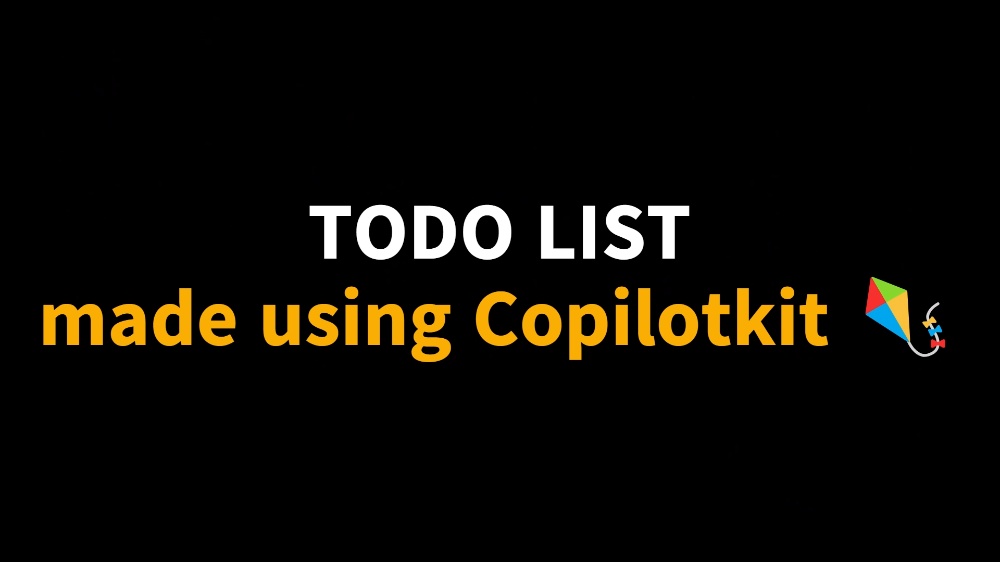
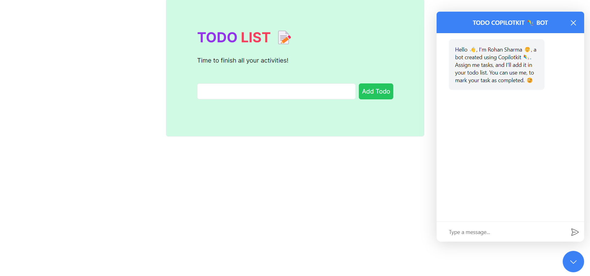
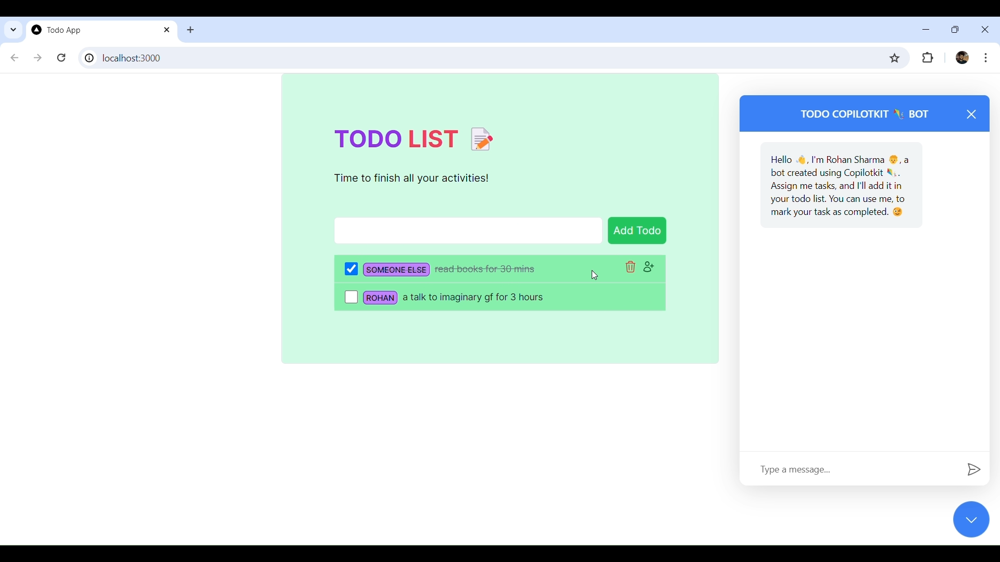
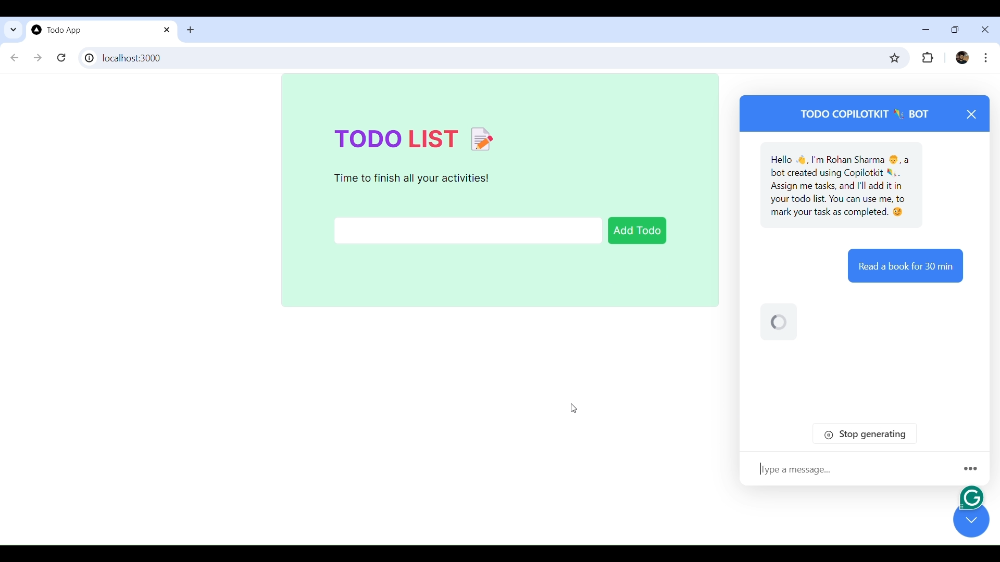
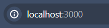

<p align="right">
    
</p>
<p align="center">
  
</p>


### TODO LIST
- TODO List is basically an action list of action items you will actually do.
- This project/application can help you to memorize all your task at one place.


### :books: Index

- [Demo](#movie_camera-Demo)
- [Screenshots](#screenshots)
- [Set Up](#outbox_tray-Set-up)
- [Contribute](#building_construction-Contribute)
- [Project Author](#people_holding_hands-Meet-the-Author)
- [Contact](#email-contact)


###  :movie_camera: Demo
- After a brief introduction, let's dive a little more inside the project.
- Here is the walk-through of Todo List Application.


<p align="center">Video Demonstration</p>

### Screenshots
<p align="center">
  
  <p align="center">App GUI</p>
  <br>
  
  <p align="center">Added List</p>
  <br>
  
  <p align="center">Using Copilotkit</p>
  <br>
</p>


$~$

## Usage
To-do lists offer a way to increase productivity, stopping you from forgetting things, helps prioritise tasks, manage tasks effectively, use time wisely and improve time management as well as workflow.


# Dependecies
1. NextJs
2. React
3. NodeJs
4. TypeScript
5. TailWind CSS
6. Copilotkit 🪁

<hr>
This is a [Next.js](https://nextjs.org/) project bootstrapped with [`create-next-app`](https://github.com/vercel/next.js/tree/canary/packages/create-next-app).

## Getting Started

First, run the development server:

```bash
npm run dev
# or
yarn dev
# or
pnpm dev
# or
bun dev
```

Open [http://localhost:3000](http://localhost:3000) with your browser to see the result.
<p align="center">
  The running port should look like this
</p>
<p align="center">

</p>

You can start editing the page by modifying `app/page.tsx`. The page auto-updates as you edit the file.

This project uses [`next/font`](https://nextjs.org/docs/basic-features/font-optimization) to automatically optimize and load Inter, a custom Google Font.

## Learn More

To learn more about Next.js, take a look at the following resources:

- [Next.js Documentation](https://nextjs.org/docs) - learn about Next.js features and API.
- [Learn Next.js](https://nextjs.org/learn) - an interactive Next.js tutorial.

You can check out [the Next.js GitHub repository](https://github.com/vercel/next.js/) - your feedback and contributions are welcome!

## Deploy on Vercel

The easiest way to deploy your Next.js app is to use the [Vercel Platform](https://vercel.com/new?utm_medium=default-template&filter=next.js&utm_source=create-next-app&utm_campaign=create-next-app-readme) from the creators of Next.js.

Check out our [Next.js deployment documentation](https://nextjs.org/docs/deployment) for more details.

<hr>

$~$
    
**Set Up Your Environment**

1. `Fork` our repository to your GitHub account. 
2. `Clone` your fork to your local machine. 
    Use the command `git clone https://github.com/RS-labhub/ToDo-List.git`.
3. Create a new branch for your work. 
    Use a descriptive name, like `fix-login-bug` or `add-user-profile-page`.
    
**Commit Your Changes**

- Commit your changes with a _clear commit message_. 
  e.g `git commit -m "Fix login bug by updating auth logic"`.

**Submit a Pull Request**

- Push your branch and changes to your fork on GitHub.
- Create a pull request, compare branches and submit.
- Provide a detailed description of what changes you've made and why. 
  Link the pull request to the issue it resolves. 🔗
    
**Review and Merge**

- I will review your pull request and provide feedback or request changes if necessary. 
- Once your pull request is approved, we will merge it into the main codebase 🥳

$~$

### :people_holding_hands: Meet the Author


### :email: Contact 
- Email and social media links.
- Head over to my github handle form [here](https://github.com/RS-labhub)

<p align="left">
<a href="https://twitter.com/rrs00179" target="blank"></a>
</p>
<p align="left">
<a href="https://www.linkedin.com/in/rohan-sharma-9386rs/" target="blank"></a>
</p>

> 📒 [!NOTE] 

> I made this project by using [Copilotkit 🪁](https://github.com/CopilotKit) demo provided by them. I'm new to React/NextJs things, So, I made a few major and minor changes to this projects.I learnt a lot from this.

<p align="left">
    Go and star ⭐ this awesome repo. <a href="https://github.com/CopilotKit" alt="copilotkit" >CopilotKit 🪁</a>
</p>